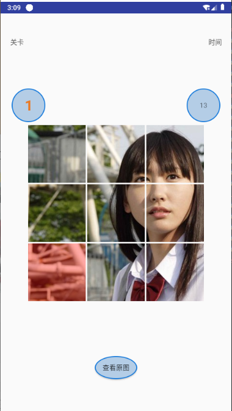
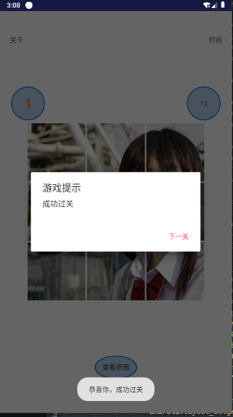

# Puzzle-games
项目简述： 拼图小游戏，计时闯关模式，有提示。自定义View写的控件

项目详细介绍：
           1.主要控件是自定义写的继承RelativeLayout写的一个自定义View控件，变量为容器，小图的间距，图片，数量，游戏面板的宽高等。
           2.根据当前关卡等级进行关卡倒计时的计算，和图片的分割数量增加。
           3.点击图片交换实现动画层效果，动画层的构造，交换和监听设置。
           4.游戏成功或失败，查看原图答案等功能。

项目运行截图： 
- 
- 
- 
- 
- 
